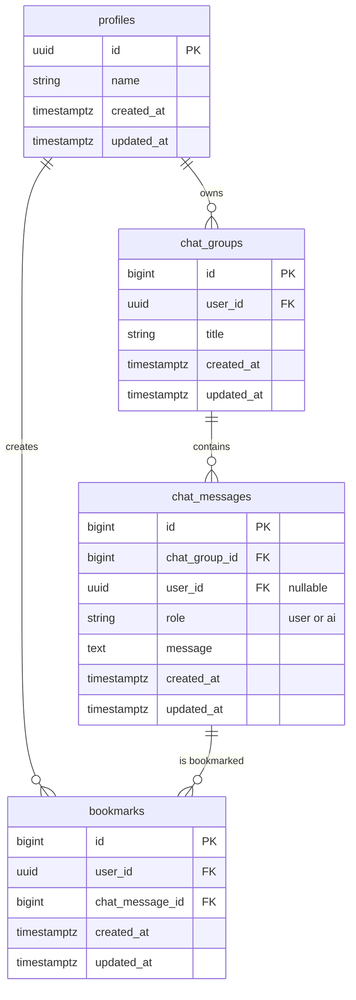

# DB 設計書

本ドキュメントは、AI チャット英語学習システムのデータベース設計を定義します。
`要件定義書.md` に基づき、システムが必要とするデータを永続化するためのテーブル構造を設計します。

## 1. 設計思想

- **正規化**: データの冗長性を排除し、一貫性を保つために正規化を意識した設計とします。
- **拡張性**: 将来的な機能追加（多言語対応、複数ユーザー対応など）を考慮し、スケールしやすい構造を目指します。
- **シンプルさ**: 初期開発においては、要件を過不足なく満たすシンプルな設計を心がけます。

## 2. ER 図

## 3. テーブル定義

### 3.1. `profiles` テーブル

Supabase の認証ユーザー (`auth.users`) に紐づく、アプリケーション固有のユーザー情報を格納します。

| カラム名     | データ型       | 制約                                                         | 説明                                                                                    |
| :----------- | :------------- | :----------------------------------------------------------- | :-------------------------------------------------------------------------------------- |
| `id`         | `UUID`         | `PRIMARY KEY`, `REFERENCES auth.users(id) ON DELETE CASCADE` | `auth.users` テーブルの ID を参照する。ユーザー削除時にプロフィールも自動で削除される。 |
| `name`       | `VARCHAR(255)` |                                                              | ユーザーの表示名                                                                        |
| `created_at` | `TIMESTAMPTZ`  | `NOT NULL`, `DEFAULT now()`                                  | 作成日時                                                                                |
| `updated_at` | `TIMESTAMPTZ`  | `NOT NULL`, `DEFAULT now()`                                  | 更新日時                                                                                |

### 3.2. `chat_groups` テーブル

チャットの会話グループを管理します。1人のユーザーが複数のチャットグループを作成でき、各グループは独立した会話履歴を持ちます。

| カラム名     | データ型       | 制約                                              | 説明                                  |
| :----------- | :------------- | :------------------------------------------------ | :------------------------------------ |
| `id`         | `BIGINT`       | `PRIMARY KEY`, `GENERATED BY DEFAULT AS IDENTITY` | チャットグループを一意に識別する ID   |
| `user_id`    | `UUID`         | `FK (auth.users.id)`, `NOT NULL`                  | このグループを所有するユーザーの ID   |
| `title`      | `VARCHAR(255)` | `NOT NULL`                                        | チャットグループのタイトル            |
| `created_at` | `TIMESTAMPTZ`  | `NOT NULL`, `DEFAULT now()`                       | 作成日時                              |
| `updated_at` | `TIMESTAMPTZ`  | `NOT NULL`, `DEFAULT now()`                       | 更新日時                              |

### 3.3. `chat_messages` テーブル

ユーザーと AI の対話履歴を格納します。各メッセージは特定のチャットグループに属します。

| カラム名         | データ型      | 制約                                              | 説明                                            |
| :--------------- | :------------ | :------------------------------------------------ | :---------------------------------------------- |
| `id`             | `BIGINT`      | `PRIMARY KEY`, `GENERATED BY DEFAULT AS IDENTITY` | メッセージを一意に識別する ID                   |
| `chat_group_id`  | `BIGINT`      | `FK (chat_groups.id)`, `NOT NULL`                 | このメッセージが属するチャットグループの ID     |
| `user_id`        | `UUID`        | `FK (auth.users.id)`                              | 発言したユーザーの ID。AI の発言の場合は `NULL` |
| `role`           | `VARCHAR(50)` | `NOT NULL`                                        | 発言者の役割 (`'user'` or `'ai'`)               |
| `message`        | `TEXT`        | `NOT NULL`                                        | メッセージ本文                                  |
| `created_at`     | `TIMESTAMPTZ` | `NOT NULL`, `DEFAULT now()`                       | 作成日時                                        |
| `updated_at`     | `TIMESTAMPTZ` | `NOT NULL`, `DEFAULT now()`                       | 更新日時                                        |

### 3.4. `bookmarks` テーブル

ユーザーがブックマークしたチャットメッセージを管理します。気に入った英語表現を含むメッセージを保存できます。

| カラム名           | データ型      | 制約                                              | 説明                                         |
| :----------------- | :------------ | :------------------------------------------------ | :------------------------------------------- |
| `id`               | `BIGINT`      | `PRIMARY KEY`, `GENERATED BY DEFAULT AS IDENTITY` | ブックマークを一意に識別する ID              |
| `user_id`          | `UUID`        | `FK (auth.users.id)`, `NOT NULL`                  | ブックマークしたユーザーの ID                |
| `chat_message_id`  | `BIGINT`      | `FK (chat_messages.id)`, `NOT NULL`               | ブックマークされたメッセージの ID            |
| `created_at`       | `TIMESTAMPTZ` | `NOT NULL`, `DEFAULT now()`                       | 作成日時                                     |
| `updated_at`       | `TIMESTAMPTZ` | `NOT NULL`, `DEFAULT now()`                       | 更新日時                                     |
|                    |               | `UNIQUE (user_id, chat_message_id)`               | ユーザーは同じメッセージを複数ブックマークできない |

</rewritten_file>
